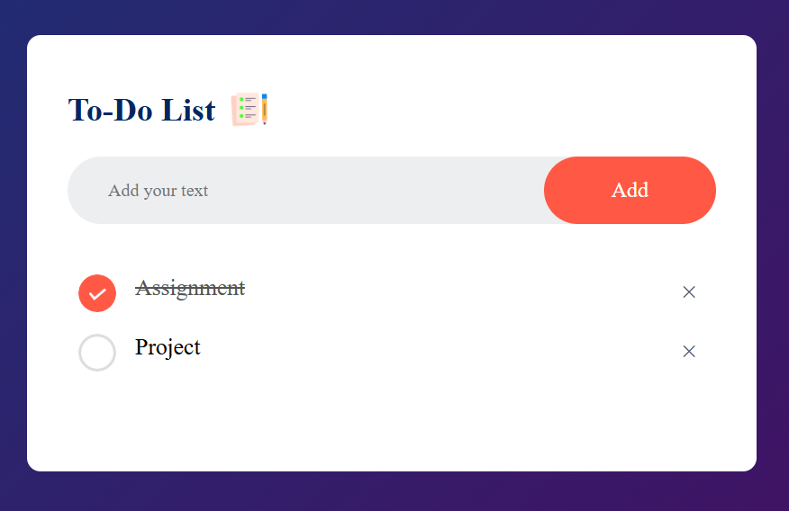

# To-Do List

A simple To-Do List web application that allows users to add, check, and delete tasks. The tasks are saved using local storage, so they persist even after the page is refreshed.

## Features
- Add new tasks
- Mark tasks as completed
- Remove tasks
- Save tasks in local storage

## Technologies Used
- HTML
- CSS
- JavaScript

## How to Use
1. Clone the repository:
   ```bash
   git clone https://github.com/manishrathod2003/todo-list.git
   ```
2. Open the `index.html` file in a web browser.
3. Enter a task in the input field and click the 'Add' button.
4. Click on a task to mark it as completed.
5. Click the '×' button to delete a task.
6. The tasks are saved automatically and will be available when you revisit the page.

## File Structure
```
📂 todo-list
│── 📄 index.html    # Main HTML structure
│── 📄 styles.css    # Styling for the application
│── 📄 script.js     # JavaScript logic for task management
│── 📂 images        # Folder for icons/images
```

## Screenshots
  


## Future Enhancements
- Add task editing functionality
- Implement categories or priority levels
- Sync tasks with a backend database

## Contributing
Feel free to fork this repository and contribute improvements! Pull requests are welcome.

## License
This project is open-source and available under the [MIT License](LICENSE).

